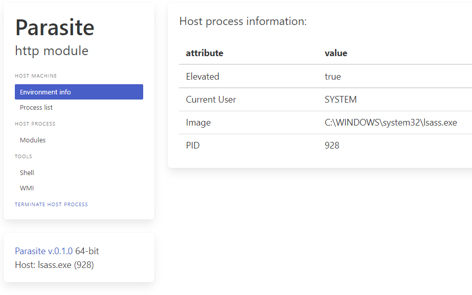
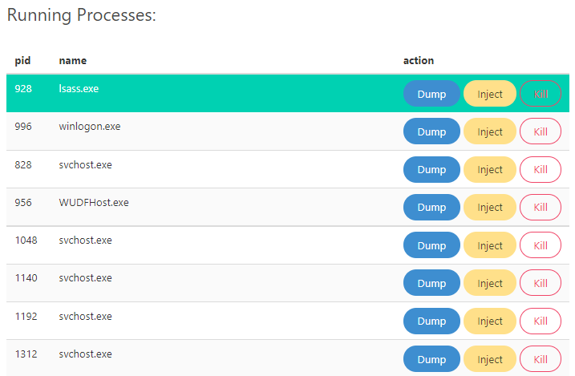

# Parasite - Injecting Some Fun into DLL Manipulation

Tired of boring dll injection tools? 🦠 Meet **Parasite**, a Nim-based library designed to make process manipulation exciting! 🚀 Combining the power of Winim & Jester with a user-friendly interface built on HTMX and Bulma CSS, Parasite injects  fun into even the most mundane hacking tasks.





## Parasite Highlights

* **Inject Delight:** Run code on DLL load (`DllMain`), optionally creating a separate thread and simulating necessary exports to satisfy the loader.
* **Temporarily Disabling Loader Lock for Thread Creation:** To avoid potential deadlocks when interacting with WinAPI functions like `CreateThread` and `WaitForSingleObject`, the [LoaderLock is temporarily disabled](https://github.com/srozb/parasite/blob/master/src/lockpick.nim#L16) during thread creation. This ensures seamless execution of these system calls without introducing synchronization conflicts.
* **Remote Control**:  Spin up an HTTP server within the injected process, enabling remote control and communication (perfect for targets like `lsass.exe`).
* **Process Playtime:** Dynamically load/unload dlls in running processes for on-the-fly modifications.
* **Memory Snapshot:** Capture a full snapshot of the target's memory using `dbghelp.dll`'s  `MiniDumpWriteDump`.
* **Process Migration**: Hop between processes with classic DLL injection techniques (using `WriteProcessMemory`, `CreateRemoteThread`, and `LoadLibrary`).
* **Command Execution**: Execute shell commands within the context of your injected process for stealthy control. 
* **Modularity & Speed:**  Parasite's design encourages easy extensibility - build standalone executables (injectors, dumpers) with ease! And it's lightning-fast!⚡️

## Getting Started

**Tested under**:

* Windows 10 x64 19042
* Nim Compiler v.2.0.0

**Dependencies:**

(Manage via nimble install)

* [Winim = 3.9.3](https://github.com/khchen/winim)
* [Jester = 0.6.0](https://github.com/dom96/jester)
* [Nimja = 0.8.7](https://github.com/enthus1ast/nimja)
* [psutil = 0.6.1](https://github.com/enthus1ast/psutil-nim)

**Building Parasite:**

Precompiled x64 binaries are available for download in the releases section of this repo - no setup required, just start pwning!

**Manual Build:**

```batch
nimble build
```

or

```batch
nim c --app=lib --nomain -d:dumper -d:release --passL:-s -o:parasite-x64.dll src\parasite.nim
nim c --app=lib --nomain -d:dumper -d:fakeexports -d:release --passL:-s -o:dbghelp.dll parasite.nim
```

For a DLL with fake exports use `-d:fakeexports` after you adjust `src\fakeexports.nim` with the required exports.

**x86 Support:**

You can use 32-bit version of Nim to compile parasite to x86 arch.
Alternatively, you can cross-compile on x64:

1. Ensure mingw-32 is in your path variable.
2. Compile with the following flags:

```batch
nim --cpu:i386 -d:release c src\parasite.nim
```

## Known Limitations

* This project has been flagged as potentially malicious by certain antivirus vendors. This is likely because it has previously been weaponized and submitted to VT.
* The WMI module is still under development

---

**This project draws inspiration from:**

* The amazing [OffensiveNim](https://github.com/byt3bl33d3r/OffensiveNim) repository.
* Loader Lock unlocking technique haveily inspired on work of [@ElliotKillick](https://github.com/ElliotKillick) especially his [LdrLockLiberator](https://github.com/ElliotKillick/LdrLockLiberator) repository.
